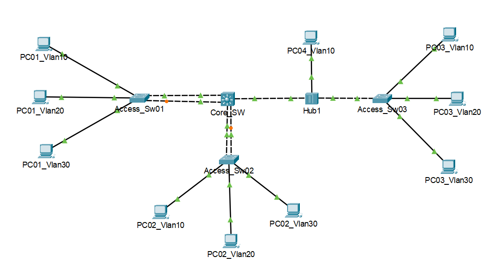

# Enterprise Network Infrastructure: Switching & Security Lab

Bu layihə, korporativ şəbəkə mühitində Layer 2 və Layer 3 switching texnologiyalarının tətbiqi, şəbəkə təhlükəsizliyinin (hardening) və redundansın təmin edilməsi məqsədilə hazırlanmışdır.

## Şəbəkə Topologiyası

Burada laboratoriya işinin vizual sxemi əks olunub:




## 📌 Layihənin Məqsədi
Şəbəkə daxilində VLAN-ların mərkəzləşdirilmiş idarəetməsini qurmaq, EtherChannel vasitəsilə switch xətləri arasında LAG qurmaq və istifadə olunmayan portları "Null VLAN" strategiyası ilə təhlükəsiz hala gətirməkdir.

## 🚀 Texniki Konfiqurasiya

### 1. VTP (VLAN Trunking Protocol)
VLAN idarəetməsini avtomatlaşdırmaq üçün VTP v2 tətbiq olunub:
- **Core Switch (Core_L3_Sw01):** VTP Server
- **Access Switches (01, 02, 03):** VTP Client
- **Domain:** `LAB_NETWORK` | **Password:** `Cisco123`
- **VLAN Strukturu:** 10 (Native), 20 (Sales), 30 (User), 40 (Guest), 499 (Null).

### 2. Layer 2 Təhlükəsizlik və Hardening
Şəbəkəni daxili təhdidlərdən qorumaq üçün aşağıdakı tədbirlər görülüb:
- **VLAN Filtering:** Trunk xətlərdə yalnız zəruri olan VLAN-lara (10, 20, 30) icazə verilib.
- **Port Security (Unused Ports):** Aktiv olmayan bütün portlar `shutdown` edilib və fiziki olaraq heç bir yerə routing olunmayan **VLAN 499**-a daxil edilib.
- **CDP Management:** Təhlükəsizlik məqsədilə istifadəçi portlarında CDP protokolu söndürülüb.

### 3. Redundancy (EtherChannel)
Bağlantı kəsilmələrinin qarşısını almaq və sürəti artırmaq üçün port aqreqasiyası qurulub:
- **LACP (Active):** Access_Sw01 ↔ Core (Port-Channel 1)
- **PAgP (Desirable):** Access_Sw02 ↔ Core (Port-Channel 2)

### 4. Inter-VLAN Routing
Core Switch üzərində çoxşaxəli keçid (Layer 3 switching) təmin edilib:
- **VLAN 10 GW:** 192.168.10.254/24
- **VLAN 20 GW:** 192.168.20.254/24
- **VLAN 30 GW:** 192.168.30.254/24

---

## 🔍 Troubleshooting & Analiz

### Hub və Native VLAN Problemi
**Ssenari:** Hub-a qoşulu cihazların şəbəkəyə çıxışı və tag-li paketləri oxuya bilməməsi.
**Həll:** Hub cihazı 802.1Q (tagging) başa düşmədiyi üçün Core Switch-in Hub-a gedən portunda **Native VLAN 10** təyin edilib. Bu, VLAN 10-a aid paketlərin Hub-a "untagged" (etiketsiz) göndərilməsini və rabitənin bərpasını təmin edib.

---

## 🛠 İstifadə Olunan Komandalar (Nümunə)

```cisco
! VTP Configuration
vtp mode server
vtp domain LAB_NETWORK
vtp password Cisco123

! Trunk & Allowed VLANs
interface Range g0/1 - 2
 switchport mode trunk
 switchport trunk allowed vlan 10,20,30
 switchport trunk native vlan 10

! Unused Port Policy
interface range f0/10 - 24
 description disable_by_policy
 switchport access vlan 499
 shutdown
